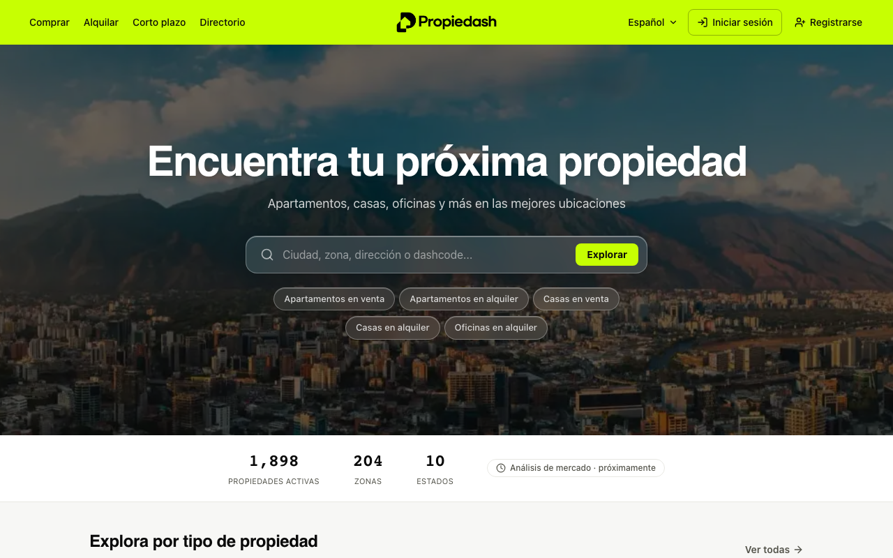
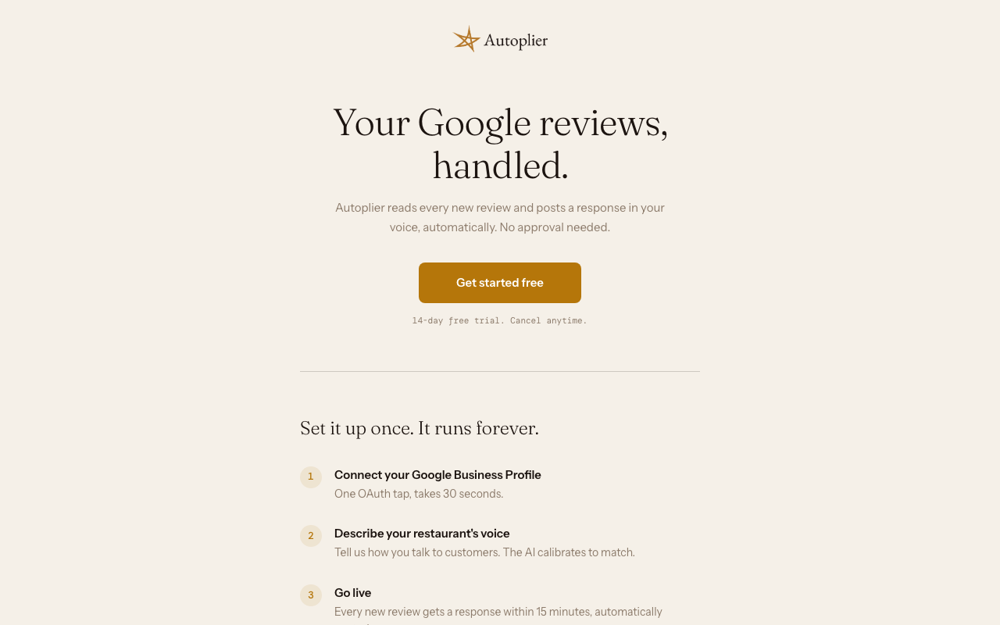

<!-- ──────────────────────────────  HERO  ────────────────────────────── -->

  
  
  
  

<!-- ────────────────────────────  BUILDING  ──────────────────────────── -->

#### ❯ BUILDING

<table>
<tr>
<td width="50%" valign="top">

  
<b>Propiedash</b> &nbsp;·&nbsp; <a href="https://propiedash.com">propiedash.com</a>
 
Venezuela's modern real-estate platform — connecting buyers, renters, and agents, with AI woven through operations end to end.
</td>
<td width="50%" valign="top">

  
<b>Autoplier</b> &nbsp;·&nbsp; <a href="https://autoplier.com">autoplier.com</a>
 
Reads every new Google review and posts a reply in your brand voice — automatically, no approval needed.
</td>
</tr>
</table>

<!-- ──────────────────────────  CONTRIBUTIONS  ────────────────────────── -->

#### ❯ CONTRIBUTIONS

<picture>
  <source media="(prefers-color-scheme: dark)" srcset="https://raw.githubusercontent.com/ndresca/ndresca/output/snake-dark.svg">
  <source media="(prefers-color-scheme: light)" srcset="https://raw.githubusercontent.com/ndresca/ndresca/output/snake.svg">
  
</picture>

<!-- ────────────────────────────  ALWAYS  ────────────────────────────── -->

#### ❯ ALWAYS

AI-native operator. I run a small team like an orchestra — decompose, delegate, and ship every day. Always building, always learning, always raising the bar.

#### ❯ LET'S BUILD

If you're building something ambitious, find me at [propiedash.com](https://propiedash.com) or [andres@casanova-aleman.com](mailto:andres@casanova-aleman.com).
